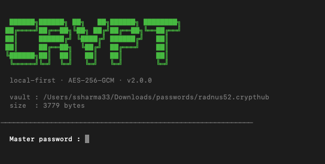

# CryptHub CLI

Manage your `.crypthub` vault from the terminal.  
Fully compatible with vaults created by the [CryptHub web app](https://crypthub.srsdevdesign.com).

Zero dependencies — Node.js built-ins only.

---

## Requirements

- Node.js 18+
- macOS, Linux, or Windows
- Chrome or Edge not required — CLI works purely in terminal

---

## Install

```bash
cd cli/
npm install -g .
```

Installs `crypthub` as a global command. Run from anywhere after install.

---

## Quick start

```bash
crypthub init     # create a new vault
crypthub open     # unlock and enter session
```

---

## Commands

### Outside a session

```bash
crypthub init              # create a new vault
crypthub open              # unlock vault, enter interactive session
crypthub use <path>        # point CLI at an existing vault file
crypthub status            # show current vault config
crypthub locate            # find all .crypthub files on your system
crypthub version           # show version
crypthub help              # show help
```

### Inside a session — Read

```
list [category]            list all entries, filter by category optionally
get  <label>               copy password to clipboard
copy <label>               alias for get
show <label>               reveal full entry including password
note <label>               view notes on an entry
search <query>             search across label, username, notes
```

### Inside a session — Write

```
add                        add a new entry interactively
add "<label> [email] [mode] [category]"
                           quick add — password auto-generated
edit   <label>             edit full entry interactively
update <label> <mode>      update password by mode — copies to clipboard
update <label> pass:<pwd>  update with exact password — copies to clipboard
rename <label> <new-label> rename an entry label
note   <label> <text>      set or update notes on an entry
delete <label>             delete an entry
```

### Inside a session — Vault

```
dashboard                  vault overview — stats, categories, recent entries
info                       vault file stats
cls                        clear screen
lock                       lock vault and exit
help                       show all commands
```

---

## Password modes

Used in `add`, `update`, and quick add:

| Mode | Length | Characters |
|---|---|---|
| `standard` | 20 | letters + numbers + symbols |
| `strong` | 32 | full character set |
| `simple` | 14 | letters + numbers only |
| `pin` | 6 | digits only |
| `pin8` | 8 | digits only |
| `words` | ~25 | `word-word-word-word-42` |

---

## Examples

**Add entry — interactive:**
```
crypthub › add
```

**Add entry — quick one-liner:**
```
crypthub › add Netflix user@test.com standard Entertainment
crypthub › add AWS admin@company.com strong Work
crypthub › add GitHub user@test.com words Dev/Tech
```

**Update password:**
```
crypthub › update Netflix strong
crypthub › update Netflix pass:myExactNewPassword123
```

**View and set notes:**
```
crypthub › note Netflix
crypthub › note Netflix shared account with family
```

**Rename an entry:**
```
crypthub › rename Netflix NetflixUS
```

**Rotate a password quickly:**
```
crypthub › update AWS strong
✓ Password updated: AWS — new password copied to clipboard.
```

---

## Example session

```
$ crypthub open

  ██████╗██████╗ ██╗   ██╗██████╗ ████████╗
 ██╔════╝██╔══██╗╚██╗ ██╔╝██╔══██╗╚══██╔══╝
 ██║     ██████╔╝ ╚████╔╝ ██████╔╝   ██║
 ██║     ██╔══██╗  ╚██╔╝  ██╔═══╝    ██║
 ╚██████╗██║  ██║   ██║   ██║        ██║
  ╚═════╝╚═╝  ╚═╝   ╚═╝   ╚═╝        ╚═╝

  local-first · AES-256-GCM · v2.0.0

  vault : /Users/you/my-vault.crypthub
  size  : 2048 bytes

  Master password : ****************

✓ Unlocked — 8 entries

  "help" — commands · "dashboard" — overview · "cls" — clear screen

crypthub › list

──────────────────────────────────────────────────────────────
  ID    LABEL                   USERNAME                CATEGORY
──────────────────────────────────────────────────────────────
  1     GitHub                  user@example.com        [Dev/Tech]  ·
  2     Netflix                 user@example.com        [Entertainment]
  3     AWS                     admin@company.com       [Work]  ·
──────────────────────────────────────────────────────────────
  3 entries                                        · = has notes

crypthub › update Netflix strong

✓ Password updated: Netflix — new password copied to clipboard.

crypthub › note Netflix shared account with family

✓ Note saved: Netflix

crypthub › rename Netflix NetflixUS

✓ Renamed: Netflix → NetflixUS

crypthub › lock

✓ Vault locked. Session cleared.
```

---

## Migrating from the web app

If you have been using the CryptHub web app and want to manage the same vault from the terminal, no data migration is required. The CLI reads the exact same `.crypthub` file the web app writes — you just need to point the CLI at the right file.

```bash
# step 1 — find your web app vault file
crypthub locate

# step 2 — point the CLI at it (file stays where it is, nothing is moved)
crypthub use ~/Downloads/my-vault.crypthub

# step 3 — confirm it's set correctly
crypthub status

# step 4 — open with the same master password you use in the browser
crypthub open
```

Once pointed at the same file, the web app and CLI share the vault completely. Changes made in the browser are visible in the terminal and vice versa — just unlock with your master password.

For detailed steps and common problems: [MIGRATING.md](./MIGRATING.md)

---

## Troubleshooting

Install errors, `command not found`, vault not found, wrong password, clipboard issues, shell PATH problems (bash vs zsh vs conda), and more.

See [TROUBLESHOOTING.md](./TROUBLESHOOTING.md)

---

## Clipboard support

| OS | Tool | Notes |
|---|---|---|
| macOS | `pbcopy` | built-in, works automatically |
| Windows | `clip` | built-in, works automatically |
| Linux | `xclip` | install with `sudo apt install xclip` |

Password is automatically copied to clipboard on `get`, `copy`, `add` (quick mode), and `update`. Never shown in terminal unless you use `show`.

---

## How it works

The CLI reads and writes the exact same `.crypthub` binary format as the web app.  
A vault created in the browser opens in the CLI and vice versa — no conversion needed.

Crypto is identical to the web app:
- PBKDF2-SHA256, 310,000 iterations
- AES-256-GCM, fresh random IV on every write
- Session key in memory only, cleared on lock

Config lives at `~/.crypthub/config.json` — just the path to your vault.  
No passwords are ever stored.

---

## Uninstall

```bash
npm uninstall -g crypthub-cli
rm -rf ~/.crypthub
```

---

## Security

See [SECURITY.md](../SECURITY.md) for the full threat model.  
CLI uses Node.js built-in `crypto` module — no third-party libraries.